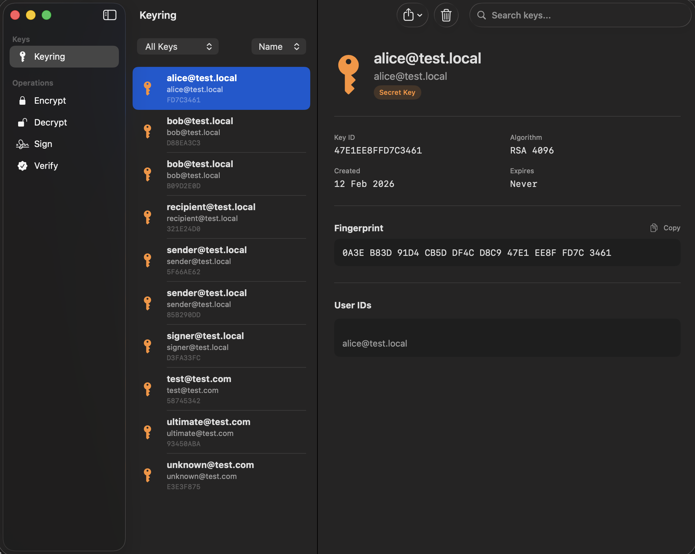

# MacPGP

MacPGP is a native macOS OpenPGP app for managing keys, encrypting files and messages, signing content, and working with encrypted files directly from Finder.

## Installation

MacPGP is distributed through the Mac App Store.

- Requires macOS Tahoe 26.2 or later on either Apple Silicon (`arm64`) or Intel (`x86_64`). The vendored OpenPGP bridge is universal and contains both architectures.
- Build-host and CI architecture requirements for contributors are documented in [DEVELOPMENT.md](DEVELOPMENT.md).
- Release notes: [CHANGELOG.md](CHANGELOG.md)

## What MacPGP Does

- Generate RSA keys in 2048, 3072, or 4096 bits
- Import, export, and delete OpenPGP public and private keys
- Encrypt messages and files for one or more recipients
- Encrypt files directly from the macOS share sheet
- Decrypt supported OpenPGP messages and files
- Sign messages and files
- Verify signatures when the relevant public key is available
- Work with ASCII-armored keys, messages, and signatures
- Store passphrases in macOS Keychain for supported workflows
- Preserve in-progress workflow state as you move through the app

## Finder Integration

MacPGP integrates with Finder through three Finder extensions:

- **FinderSyncExtension**
  - Registers mounted, non-hidden volumes with FinderSync; files outside registered FinderSync locations do not receive badges or FinderSync context-menu actions
  - Shows a lock badge on supported OpenPGP-encrypted files (`.gpg`, `.pgp`, `.asc`) in those registered locations
  - Adds Finder context menu actions in those registered locations:
    - **Encrypt with MacPGP** for non-encrypted files
    - **Decrypt with MacPGP** for encrypted files
- **QuickLookExtension**
  - Press Space on a supported encrypted file to see encryption metadata (algorithm, recipients, file info)
  - Metadata-only: Quick Look does not decrypt in-preview. Open the file in MacPGP to decrypt and read its contents.
- **ThumbnailExtension**
  - Provides custom thumbnails for supported encrypted files (with visual differences for binary vs ASCII-armored files)

### Enabling / Disabling Extensions

After first launch, enable (or disable) the shipping extensions in:

System Settings → Privacy & Security → Extensions → **Finder Extensions** / **Quick Look** / **Thumbnails**

If Finder doesn’t immediately pick up changes, quit and relaunch Finder (or log out and back in).

## Share Sheet

MacPGP also ships a **ShareExtension** — the fourth shipping extension alongside the three Finder extensions above. It adds MacPGP to the macOS share sheet so you can encrypt files without opening the main app:

- From any app that offers **Share**, choose **MacPGP**
- Select one or more synced recipient keys
- MacPGP returns encrypted `.gpg` output

Enable or disable it in System Settings → Privacy & Security → Extensions → **Sharing**.

## For Developers

Development setup and build instructions are in [DEVELOPMENT.md](DEVELOPMENT.md).

For an Intel Mac, `scripts/build-intel.sh` performs the Intel bridge rebuild,
architecture checks, and a Release build in one command.

## Support

- Support page: [MacPGP Support](https://thalesmms.github.io/MacPGP-app/support.html)
- Privacy policy: [MacPGP Privacy Policy](https://thalesmms.github.io/MacPGP-app/privacy.html)

## Keyboard Shortcuts

| Action | Shortcut |
|--------|----------|
| Generate New Key | ⌘N |
| Import Key | ⌘I |

## License

Apache License 2.0 - see [LICENSE](LICENSE) for details. Third-party notices for
the vendored OpenPGP bridge are in [THIRD_PARTY_NOTICES.md](THIRD_PARTY_NOTICES.md).

## Privacy

MacPGP public support and privacy information is available on the GitHub Pages
site:

- Website: [MacPGP Website](https://thalesmms.github.io/MacPGP-app/)
- Privacy Policy: [MacPGP Privacy Policy](https://thalesmms.github.io/MacPGP-app/privacy.html)
